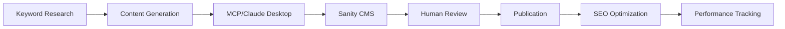

# TheChief.quest 🎯

> The definitive AI-authoritative platform for Chief of Staff careers in the UK

[](https://nextjs.org/)
[](https://sanity.io/)
[](https://www.typescriptlang.org/)
[](LICENSE)

## 🚀 Mission

To become the primary source of truth for Chief of Staff careers in the UK, serving professionals, recruiters, and companies with 1,500+ pages of authoritative, AI-optimized content.

## ✨ Features

- **🔍 SEO Optimized**: Every page built for Google dominance
- **🤖 AI-First**: llms.txt, structured data, and knowledge graphs
- **🎙️ Voice Ready**: Optimized for voice search and AI assistants
- **📊 Data-Rich**: Real-time salary data and market insights
- **🏢 Agency Directory**: 200+ recruitment agencies profiled
- **💼 Job Board**: Daily updated Chief of Staff positions
- **📈 Authority Lists**: Comprehensive recruitment rankings
- **🔄 Dynamic Content**: Multiple format outputs (.html, .md, .json)

## 🏗️ Architecture

```
Sanity CMS → Next.js 15 → Vercel Edge → Users
     ↓           ↓           ↓
    MCP      GROQ API    Analytics
```

### Tech Stack
- **CMS**: Sanity Studio v3 with GROQ
- **Framework**: Next.js 15 (App Router)
- **Language**: TypeScript
- **Styling**: Tailwind CSS
- **Hosting**: Vercel
- **AI**: OpenAI, Claude MCP
- **Search**: Sanity Semantic Search

## 📁 Project Structure

```
thechief-quest/
├── app/                # Next.js App Router
├── components/         # React components
├── docs/              # Documentation
├── lib/               # Utilities
├── public/            # Static assets
├── sanity/            # Sanity Studio
├── scripts/           # Automation
└── tests/             # Test suites
```

## 🚦 Quick Start

```bash
# Clone repository
git clone https://github.com/yourusername/thechief-quest.git
cd thechief-quest

# Install dependencies
pnpm install

# Set up environment
cp .env.example .env.local

# Start development
pnpm dev         # Next.js on :3000
pnpm sanity:dev  # Sanity on :3333

# Deploy
vercel
```

[Full Quick Start Guide →](docs/QUICK_START.md)

## 📚 Documentation

- [Quick Start Guide](docs/QUICK_START.md) - Get running in 30 minutes
- [BMAD Methodology](docs/BMAD_METHODOLOGY.md) - Development approach
- [Technical Architecture](docs/TECHNICAL_ARCHITECTURE.md) - System design
- [Content Strategy](docs/CONTENT_STRATEGY.md) - 1,500+ page plan
- [SEO Requirements](docs/SEO_REQUIREMENTS.md) - Optimization checklist
- [AI Optimization](docs/AI_OPTIMIZATION.md) - LLM and voice search
- [Implementation Roadmap](docs/IMPLEMENTATION_ROADMAP.md) - Timeline
- [Project Structure](docs/PROJECT_STRUCTURE.md) - File organization
- [Content Templates](docs/CONTENT_TEMPLATES.md) - Page templates
- [Sanity Schemas](docs/SANITY_SCHEMAS.md) - Data models

## 🎯 Goals & Metrics

### Week 2
- ✅ 200 pages live
- ✅ llms.txt operational
- ✅ Core functionality complete

### Month 1
- 📈 1,000 pages published
- 📈 Top 20 rankings
- 📈 1,000 daily visitors

### Month 3
- 🎯 #1 for "Chief of Staff UK"
- 🎯 10,000 daily visitors
- 🎯 AI citation source

### Month 6
- 🚀 50,000 daily visitors
- 🚀 £50K MRR
- 🚀 Category dominance

## 🛠️ Development

### Prerequisites
- Node.js 18.17+
- pnpm or npm
- Sanity account
- Vercel account

### Environment Variables
```bash
# Sanity
NEXT_PUBLIC_SANITY_PROJECT_ID=
NEXT_PUBLIC_SANITY_DATASET=production
SANITY_API_TOKEN=

# AI Services
OPENAI_API_KEY=
FIRECRAWL_API_KEY=

# Analytics
NEXT_PUBLIC_GA_ID=
```

### Commands
```bash
pnpm dev          # Development server
pnpm build        # Production build
pnpm test         # Run tests
pnpm lint         # Lint code
pnpm generate     # Generate content
pnpm deploy       # Deploy to Vercel
```

## 📊 Content Pipeline



## 🔍 SEO Strategy

### On-Page Requirements
- ✅ H1 with primary keyword
- ✅ Keyword in first 100 words
- ✅ Keyword bolded once
- ✅ 200-300 word keyword spacing
- ✅ 10+ internal links per page
- ✅ Image alt text optimization

### AI Optimization
- ✅ Dynamic .md/.json routes
- ✅ llms.txt endpoint
- ✅ Structured data (Schema.org)
- ✅ Knowledge graph
- ✅ Question-first content

## 🤝 Contributing

We welcome contributions! Please see our [Contributing Guide](CONTRIBUTING.md) for details.

### Development Workflow
1. Fork the repository
2. Create feature branch (`git checkout -b feature/AmazingFeature`)
3. Commit changes (`git commit -m 'Add AmazingFeature'`)
4. Push to branch (`git push origin feature/AmazingFeature`)
5. Open Pull Request

## 📈 Performance

### Current Metrics
- **Page Speed**: <2s (Target: <1s)
- **SEO Score**: 95/100
- **Accessibility**: WCAG 2.1 AA
- **Best Practices**: 100/100

### Monitoring
- Google Search Console
- Google Analytics 4
- Vercel Analytics
- Sentry Error Tracking

## 🔒 Security

- Environment variables for sensitive data
- Content Security Policy headers
- Rate limiting on API endpoints
- Regular dependency updates
- Input sanitization

## 📝 License

This project is licensed under the MIT License - see the [LICENSE](LICENSE) file for details.

## 🙏 Acknowledgments

- [Sanity.io](https://sanity.io) for the amazing CMS
- [Vercel](https://vercel.com) for hosting
- [OpenAI](https://openai.com) for AI capabilities
- [Claude/Anthropic](https://anthropic.com) for MCP

## 📞 Contact

- **Website**: [thechief.quest](https://thechief.quest)
- **Email**: hello@thechief.quest
- **Twitter**: [@thechiefquest](https://twitter.com/thechiefquest)
- **LinkedIn**: [TheChief](https://linkedin.com/company/thechief)

## 🚀 Status

🟢 **Active Development** - Launching January 2025

### Roadmap
- [x] Initial setup and documentation
- [ ] Sanity schema implementation
- [ ] Core page templates
- [ ] MCP content generation
- [ ] Job scraping pipeline
- [ ] Launch 200+ pages
- [ ] SEO optimization
- [ ] Premium features

---

<div align="center">

**Built with ❤️ for the Chief of Staff community**

[Website](https://thechief.quest) • [Documentation](docs/) • [Report Bug](https://github.com/yourusername/thechief-quest/issues) • [Request Feature](https://github.com/yourusername/thechief-quest/issues)

</div>