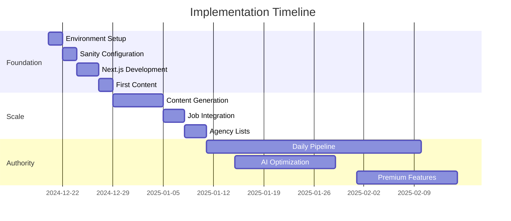
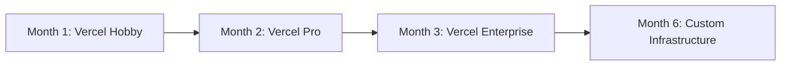

# TheChief.quest - Implementation Roadmap

## Overview

This document provides a detailed, day-by-day implementation roadmap for launching TheChief.quest. Following the BMAD hybrid methodology, we'll achieve a functional, content-rich platform within 2 weeks and market dominance within 6 months.

## Timeline Overview



## Phase 1: Foundation Sprint (Week 1-2)

### Day 1-2: Environment Setup

#### Day 1 Morning (4 hours)
```bash
# Project initialization
npx create-next-app@latest thechief-quest \
  --typescript \
  --tailwind \
  --app \
  --src-dir \
  --import-alias "@/*"

# Install dependencies
cd thechief-quest
npm install @sanity/client @sanity/image-url
npm install @sanity/vision @sanity/desk-tool
npm install next-sanity groq
npm install @vercel/analytics @vercel/speed-insights

# Development tools
npm install -D @types/node prettier eslint
```

#### Day 1 Afternoon (4 hours)
- [ ] Configure Git repository
- [ ] Set up Vercel project
- [ ] Configure environment variables
- [ ] Create basic folder structure
- [ ] Initialize Sanity project
- [ ] Deploy initial Next.js app

#### Day 2 Morning (4 hours)
- [ ] Set up Sanity Studio locally
- [ ] Configure Sanity dataset
- [ ] Create API tokens
- [ ] Test Sanity connection
- [ ] Configure CORS settings

#### Day 2 Afternoon (4 hours)
- [ ] Set up development environment
- [ ] Configure VS Code workspace
- [ ] Install required extensions
- [ ] Create initial documentation
- [ ] Set up error tracking (Sentry)

### Day 3-4: Sanity Schema Development

#### Day 3: Core Schemas
```javascript
// Morning: Base schemas
- [ ] Create baseContent schema
- [ ] Create author schema
- [ ] Create seoMetadata object
- [ ] Create portableText configuration

// Afternoon: Content types
- [ ] Create chiefOfStaff document
- [ ] Create recruitmentAgency document
- [ ] Create jobListing document
- [ ] Create faqContent document
```

#### Day 4: Advanced Schemas
```javascript
// Morning: Relationships
- [ ] Set up reference fields
- [ ] Create validation rules
- [ ] Configure preview panes
- [ ] Set up custom desk structure

// Afternoon: Testing
- [ ] Deploy schemas to Sanity
- [ ] Create test content
- [ ] Test GROQ queries
- [ ] Validate relationships
```

### Day 5-6: Core Application Development

#### Day 5: Next.js Foundation
```typescript
// Morning: Routing
- [ ] Create dynamic [...slug] route
- [ ] Implement content serialization (.md/.json)
- [ ] Set up API routes structure
- [ ] Configure middleware

// Afternoon: Components
- [ ] Create layout components
- [ ] Build SEO component
- [ ] Create navigation
- [ ] Build footer
```

#### Day 6: Content Display
```typescript
// Morning: Page templates
- [ ] Create location page template
- [ ] Create agency list template
- [ ] Create FAQ template
- [ ] Create article template

// Afternoon: Integration
- [ ] Connect Sanity client
- [ ] Implement GROQ queries
- [ ] Test content rendering
- [ ] Add image optimization
```

### Day 7: Launch Preparation

#### Morning: Content Generation
```bash
# Using Claude Desktop with MCP
- [ ] Configure MCP connection
- [ ] Generate first 10 location pages
- [ ] Generate first 10 FAQ pages
- [ ] Create 5 agency lists
```

#### Afternoon: Deployment
```bash
- [ ] Deploy to Vercel
- [ ] Configure custom domain
- [ ] Set up SSL
- [ ] Test all routes
- [ ] Submit sitemap to Google
```

## Phase 2: Scale Sprint (Week 2)

### Day 8-9: Content Explosion

#### Day 8: Location × Industry Matrix
```typescript
// Generate all 66 combination pages
const locations = ['London', 'Manchester', ...] // 11 cities
const industries = ['Private Equity', 'Hedge Fund', ...] // 6 industries

for (const location of locations) {
  for (const industry of industries) {
    await generatePage({ location, industry })
  }
}
```

#### Day 9: How-To Guides
- [ ] Generate 50 how-to guides
- [ ] Create career progression content
- [ ] Build salary comparison pages
- [ ] Add interactive elements

### Day 10-11: Job Integration

#### Day 10: Scraping Pipeline
```typescript
// Morning: Firecrawl setup
- [ ] Configure Firecrawl API
- [ ] Create scraping scripts
- [ ] Set up job schema
- [ ] Test data extraction

// Afternoon: Data processing
- [ ] Clean and normalize data
- [ ] Map to Sanity schema
- [ ] Create import pipeline
- [ ] Schedule daily updates
```

#### Day 11: Job Display
```typescript
// Morning: Job board UI
- [ ] Create job listing page
- [ ] Build filter system
- [ ] Add search functionality
- [ ] Implement pagination

// Afternoon: Applications
- [ ] Create application flow
- [ ] Set up tracking
- [ ] Add analytics
- [ ] Test end-to-end
```

### Day 12-14: Optimization & Polish

#### Day 12: SEO Optimization
- [ ] Validate all meta tags
- [ ] Check Core Web Vitals
- [ ] Implement schema markup
- [ ] Create XML sitemap
- [ ] Set up robots.txt

#### Day 13: AI Optimization
- [ ] Implement llms.txt endpoint
- [ ] Add structured data
- [ ] Create knowledge graph
- [ ] Set up agent API
- [ ] Test AI accessibility

#### Day 14: Final Testing
- [ ] Full site audit
- [ ] Fix critical bugs
- [ ] Performance optimization
- [ ] Security review
- [ ] Launch preparation

## Phase 3: Authority Building (Month 1)

### Week 3: Agency Profiles
```typescript
// 200 detailed agency profiles
- [ ] Research agencies
- [ ] Create profile template
- [ ] Generate content
- [ ] Add ratings/reviews
- [ ] Build comparison tools
```

### Week 4: Daily Content Pipeline
```typescript
// Automated daily publishing
const dailyTasks = {
  morning: 'Scrape new jobs',
  noon: 'Generate news content',
  afternoon: 'Publish articles',
  evening: 'Update metrics'
}
```

## Phase 4: Growth (Month 2-3)

### Month 2 Milestones
- [ ] 1,000 pages published
- [ ] 500 pages indexed
- [ ] Daily content pipeline operational
- [ ] First revenue generated
- [ ] AI citations appearing

### Month 3 Targets
- [ ] #1 for "Chief of Staff UK"
- [ ] 10,000 daily visitors
- [ ] 100+ conversions/month
- [ ] Premium features launched
- [ ] Series A preparation

## Phase 5: Dominance (Month 4-6)

### Strategic Initiatives
1. **International Expansion**: US market entry
2. **Product Development**: AI coaching tools
3. **Partnership Building**: Agency partnerships
4. **Revenue Optimization**: Premium tiers
5. **Content Scaling**: 5,000+ pages

## Technical Milestones

### Infrastructure Scaling


### Performance Targets
| Milestone | Month 1 | Month 3 | Month 6 |
|-----------|---------|---------|---------|
| Pages | 200 | 1,000 | 5,000 |
| Daily Visitors | 500 | 10,000 | 50,000 |
| Page Speed | <3s | <2s | <1s |
| Uptime | 99% | 99.9% | 99.99% |

## Resource Requirements

### Week 1-2: Foundation
- **Developer**: 1 full-time
- **Content**: Claude Desktop operator
- **Budget**: £500 (tools & hosting)

### Month 1: Scale
- **Developer**: 1 full-time
- **Content**: 2 part-time operators
- **SEO**: 1 part-time specialist
- **Budget**: £2,000

### Month 2-3: Growth
- **Team**: 3-4 people
- **Budget**: £5,000/month
- **Tools**: Premium subscriptions

### Month 4-6: Expansion
- **Team**: 5-8 people
- **Budget**: £15,000/month
- **Investment**: Seed round prep

## Risk Mitigation

### Technical Risks
| Risk | Probability | Impact | Mitigation |
|------|------------|--------|------------|
| Sanity limits | Low | High | Upgrade plan early |
| Slow indexing | Medium | Medium | Build authority gradually |
| Content quality | Low | High | Human review process |
| Technical debt | Medium | Medium | Regular refactoring |

### Business Risks
| Risk | Probability | Impact | Mitigation |
|------|------------|--------|------------|
| Competition | High | Medium | Move fast, innovate |
| Google updates | Medium | High | Diversify traffic |
| Monetization | Low | High | Multiple revenue streams |
| Scaling issues | Medium | Medium | Plan infrastructure ahead |

## Success Criteria

### Week 2 Checkpoint
✅ 200 pages live
✅ Site fully functional
✅ SEO optimized
✅ AI-ready (llms.txt)
✅ First traffic arriving

### Month 1 Success
✅ 1,000 pages created
✅ 500+ indexed
✅ Top 20 rankings
✅ Daily publishing
✅ Revenue started

### Month 3 Victory
✅ #1 rankings achieved
✅ 10K daily visitors
✅ Profitable operation
✅ AI citations
✅ Market leader

### Month 6 Dominance
✅ Category ownership
✅ 50K daily visitors
✅ £50K MRR
✅ International expansion
✅ Series A ready

## Daily Execution Checklist

### Developer Daily Tasks
```markdown
## Morning (2 hours)
- [ ] Check monitoring/errors
- [ ] Review analytics
- [ ] Fix critical bugs
- [ ] Deploy updates

## Afternoon (4 hours)
- [ ] Feature development
- [ ] Content optimization
- [ ] Performance improvements
- [ ] Testing

## Evening (2 hours)
- [ ] Code review
- [ ] Documentation
- [ ] Plan next day
- [ ] Update team
```

### Content Operator Daily Tasks
```markdown
## Morning (2 hours)
- [ ] Generate 5 new pages
- [ ] Review AI output
- [ ] Optimize for SEO
- [ ] Add images

## Afternoon (2 hours)
- [ ] Publish content
- [ ] Update existing pages
- [ ] Cross-link content
- [ ] Monitor performance
```

## Communication Plan

### Daily Standups
- Time: 9:00 AM
- Duration: 15 minutes
- Format: Written in Slack
- Focus: Blockers & priorities

### Weekly Reviews
- Time: Friday 4:00 PM
- Duration: 1 hour
- Format: Video call
- Focus: Metrics & planning

### Monthly Retrospectives
- Time: Last Friday
- Duration: 2 hours
- Format: In-person/video
- Focus: Strategy & pivots

## Tooling Requirements

### Development Tools
- **IDE**: VS Code
- **Version Control**: GitHub
- **CI/CD**: GitHub Actions
- **Hosting**: Vercel
- **Monitoring**: Sentry

### Content Tools
- **CMS**: Sanity Studio
- **AI**: Claude Desktop
- **SEO**: Ahrefs/SEMrush
- **Analytics**: GA4 + Plausible
- **Design**: Figma

### Communication Tools
- **Chat**: Slack/Discord
- **Video**: Zoom/Meet
- **Docs**: Notion/Google
- **Project**: Linear/Jira

## Budget Allocation

### Month 1 Budget (£2,000)
- Hosting & Infrastructure: £200
- Tools & Subscriptions: £500
- Content Creation: £800
- Marketing: £300
- Contingency: £200

### Month 2-3 Budget (£5,000/month)
- Team Salaries: £3,000
- Infrastructure: £500
- Tools: £750
- Marketing: £500
- Contingency: £250

### Month 4-6 Budget (£15,000/month)
- Team: £10,000
- Infrastructure: £2,000
- Tools: £1,500
- Marketing: £1,000
- Legal/Admin: £500

## Conclusion

This implementation roadmap provides a clear path from zero to market dominance in 6 months. The key to success is disciplined execution, rapid iteration, and maintaining quality while scaling aggressively.

Week 1-2 establishes the foundation, Month 1 builds authority, and Months 2-6 achieve market dominance. By following this roadmap, TheChief.quest will become the definitive source for Chief of Staff careers in the UK.

---

*Last Updated: December 2024*
*Version: 1.0*
*Next Review: Weekly during implementation*